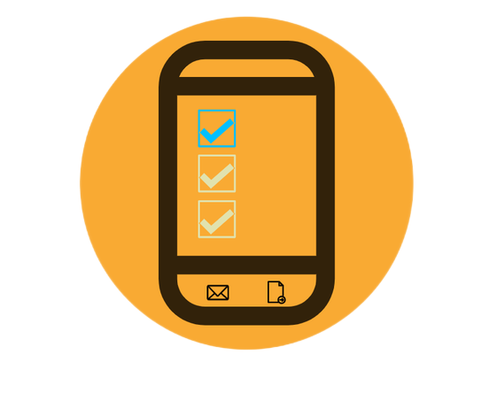

# Smart Attendance App

An attendance taker app for teachers, mentors and professors.
Unlike other apps, Smart Attendance App is free and open source.  

Smart Attendance App is available on the Google Play Store.

  

## About

The project deals with student attendance taking system. The Teacher may take
the attendance and mark the present students using checkbox provided in front 
of every Roll number. This attendance sheet is created and can be sent anywhere. 
This is very simple and user friendly attendance management system for teacher, 
who want to digitize their student attendance record using smart phone.

This application was originally created by Kartik Budholiya and released under the MIT [LICENSE](LICENSE).

## Features

The android app lets you:
- Take attendance of class using your phone
- Shows summary of attendance
- Attendance will be converted to excel file
- Attendance can be mailed with attached excel file
- Attendance sheet can be exported anywhere you like
- Completely ad-free.
- Needs no special permissions.

## Feature Graphic

  

    

## Contributing

Smart Attendance App is a free and open source project. Any contributions are welcome. Here are a few ways you can help:
 * Report bugs and make suggestions.
 * Translate the app.
 * Write some code. Please follow the code style used in the project to make a review process faster.

## License

This application is released under MIT (see [LICENSE](LICENSE)).

